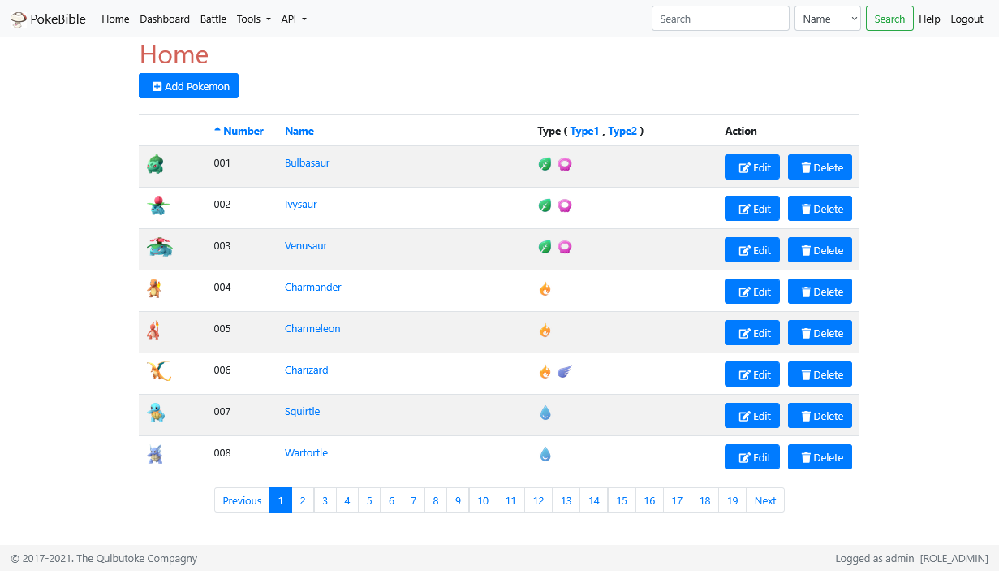
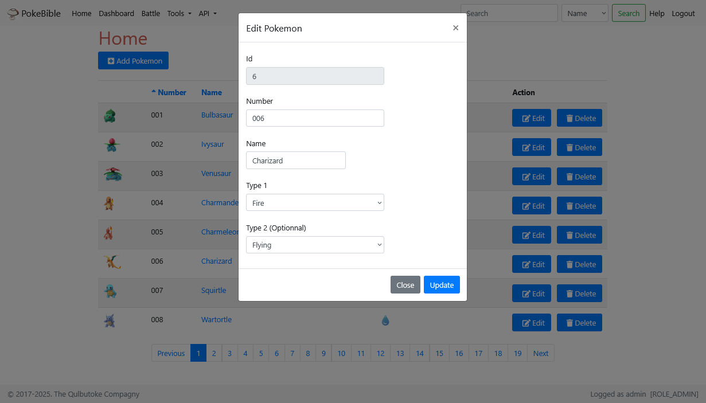
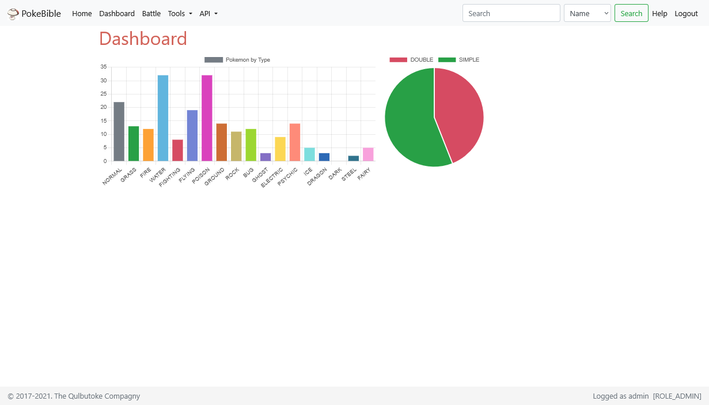
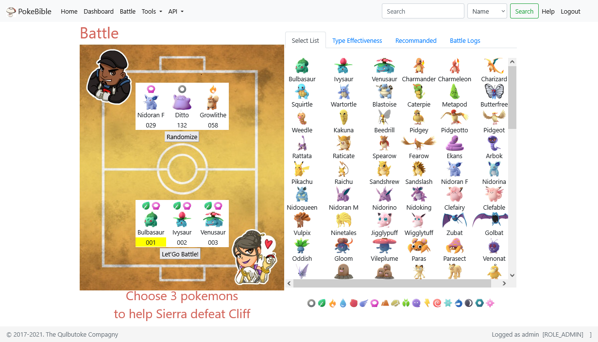
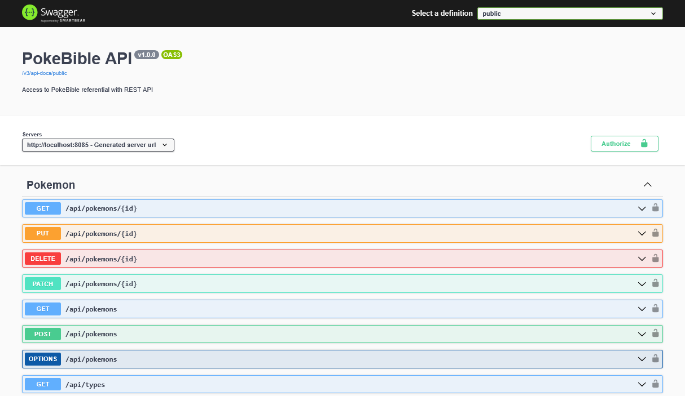

# Pokebible
Pokebible is a Spring-Boot DEMO application included Tymleaf, Security, Jpa, Rest API, Swagger, Actuator... frameworks 

All is included in the same application as sample, for real implementation cut them in several project.

Edit: 2005/06/02 - Still working but project made in 2017... So using technologies from this age, use it as retro-programming project only ;)

## Screenshots

### Home

### Edit

### Dashboard

### Battle Game

### Swagger

## Credentials

### To use UI: 

You must be logon as a simple user or an admin.

    user / password: Simple user with read access
    admin / password: Admin user with CRUD rights

### To use API:

You can obtain a valid token by using /api/auth/generateToken (same credentials as UI) and then use the token on all API provided (via Swagger or Postman)

A external html sample page (index.html in Clientjs) is also provided to be launch in your default browser and access API (need to be modified with valid token)

## Jenkins

Jenkins build scripts are provided to compile and deploy artifact of the project

See also my continuous integration environement project on https://github.com/fizou/ProductionGo to go further
